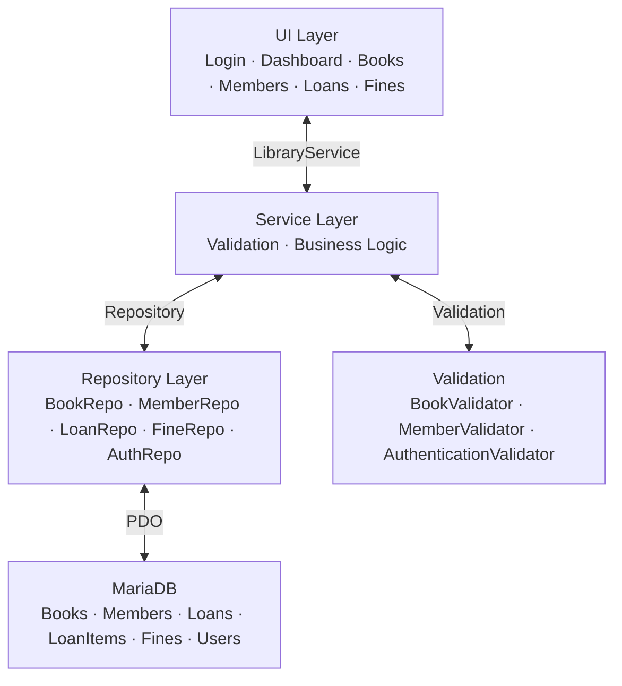
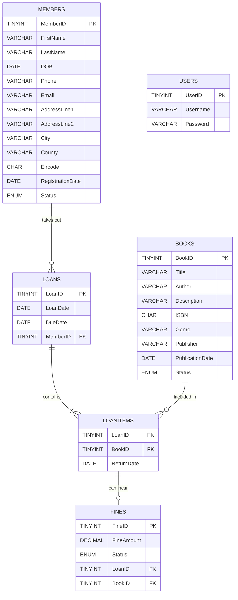

# LibrarySYS
LibrarySYS is a web-based, intuitive library management system designed to support the daily operation of a library. The system is designed to streamline book management, member management, loan transaction and return management, and performing administration, while ensuring data integrity and strict adherence to the rules of the business.

## Features
- Authentication - Secure login/logout with bcrypt password hashing and role-based access control.
- Dashboard - Allow users to view library records at a glance.
- Book Management - Add and view all books in the library.
- Member Management - Add, Delete, Update and View all members in the library system.
- Loan Processing - Process loans for members with strict validation.
- Return Processing - Handle book returns.
- Fine Management - Track and process outstanding fines linked to member loans.

## Tech Stack


## Architecture
The LibrarySYS follows a Service-Repository Pattern:


## Entity Relationship Diagram


## Installation
### Prerequisites
- XAMPP
- PHP 8
- MariaDB
- Visual Studio Code or any PHP-compatible IDE

### Steps
1. Clone the repository into your XAMPP htdocs folder:
```terminal
C:\xampp\htdocs\LibrarySYS-PHP\
```

2. Navigate to MariaDB:
```terminal
C:\> cd\xampp\mysql\bin
C:\xampp\mysql\bin> mysql -u root -p
```

3. When prompted for a password, press Enter.

4. Once you are in the MariaDB environment, create the database:
```mysql
CREATE DATABASE LibrarySYS;
```

5. Exit the MariaDB environment and execute the following:
```terminal
C:\xampp\mysql\bin>mysql.exe -u root -p LibrarySYS < \LibrarySYS.sql
```

6. When prompted for a password, press Enter.
7. The database is now loaded into the LibrarySYS database.

8. Re-enter the MariaDB environment:
```terminal
C:\xampp\mysql\bin> mysql -u root -p
```
9. Use the earlier created database and confirm the tables are present:
```mysql
USE LibrarySYS;
SHOW TABLES;
```
10. Start Apache and MariaDB in the XAMPP Control Panel.
11. Open the application in your browser: http://localhost/LibrarySYS-PHP
